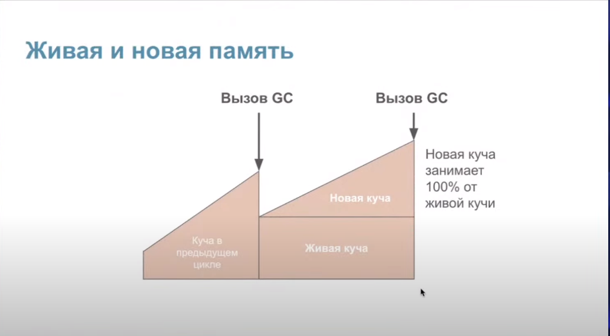
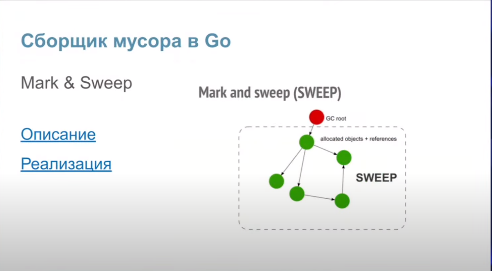
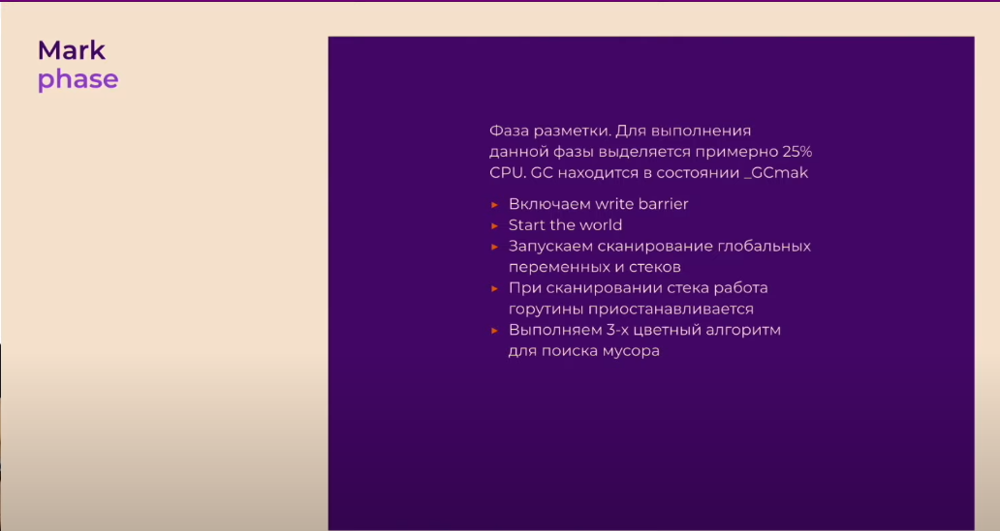
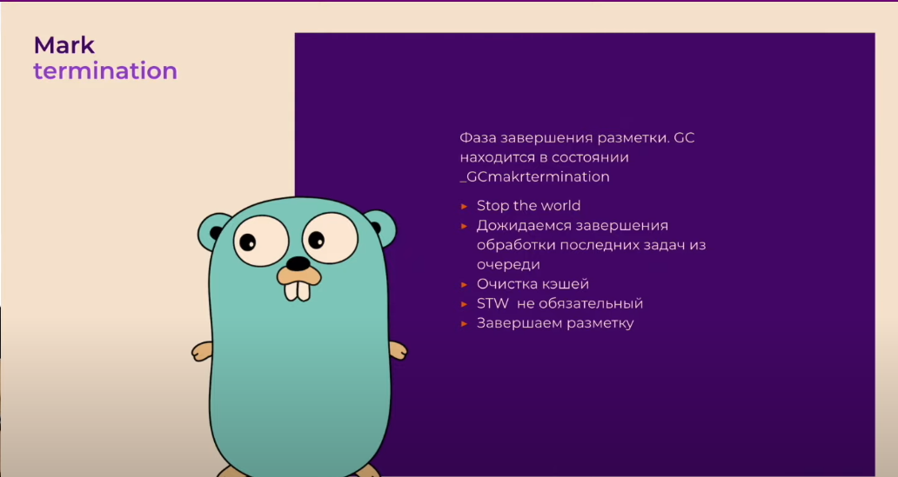
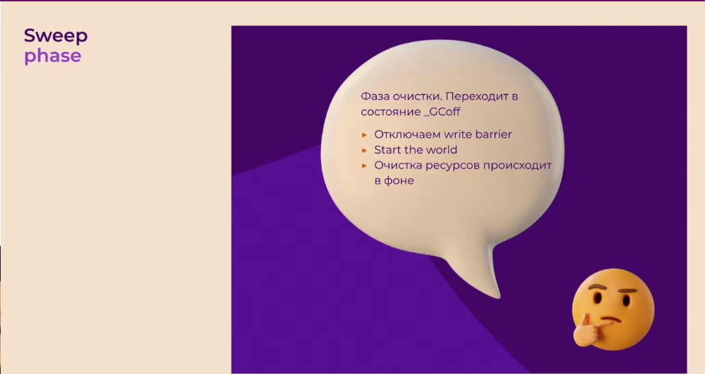

- escape analysis - компилятор определяет "сбежит" ли переменная из стека в кучу
- для проверки go run -gcflags=-m main.go
- массивы больше 10МБ сбегут в кучу, слайсы больше 64КБ сбегут в кучу

- сборщик мусора работает по принципу mark and sweep: сначала проходит от корневого объекта по дереву объектов и помечает живые объекты, все не помеченные удаляются
- алгоритм трехцветный - черный это корневой объект, серый это потомок черного (и тоже станет черным), белый - мусор (на который никто не указывает)
- stop the world - полная остановка программы, необходима для включения и отключения барьера записи
- переменная GOGC - процент новой необработанной памяти кучи от живой памяти, при достижении которого будет запущена сборка мусора; GOGC = 100 означает, что сборка мусора будет запущена, когда объем новой памяти достигнет 100% от объема живой пямяти кучи (альтернативно можно сделать через debug.SetGCPercent)
- за размером памяти следит pacer
- ручной запуск с помощью runtime.GC(). Если сделать этот вызов, когда Garbage Collector уже запущен, то по достижении фазы Sweep он запустится заново
- отключить сборку мусора можно черезе GOGC = off или debug.SetGCPercent(-1)
- чтобы избежать ошибки 137 out of memory используется переменная GOMEMLIMIT или debug.SetMemoryLimit. Задает общее количество памяти, которое рантайм может использовать
- трехцветный алгоритм разметки выполняется параллельно с основой программой, которая называется мутатором. Для поддержания консистентности данных в куче используется write barrier
- его основная задача - следить, чтобы черные объекты не указывали на белые

- для оптимизации использования памяти можно использовать sync.Pool или арену
- sync.Pool это хранилище объектов (одного типа), из которого их можно брать "на прокат" и потом возвращать, тем самым каждый раз используя одну и ту же память, не аллоцируя ничего нового. Потокобезопасен
- арена это аллоцированный большой кусок памяти, который сам управляет памятью без помощи GC. Освобождается целиком. Уменьшает количество вызово GC. Не потокобезопасен
   
  
  
  
  
  
