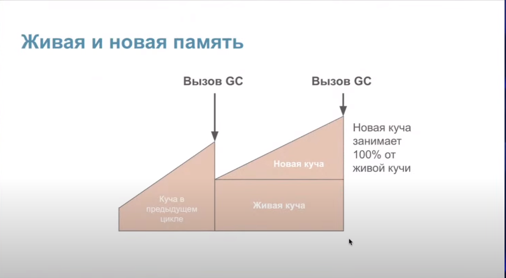

# Go

## Basics

- нельзя x:=y++
- нельзя ++x
- типы в go:
  - фундаментальные типы
  - составные (агрегированные) типы
  - ссылочные типы
  - типы интерфейсов
- env GOPATH - определяет корневой каталог рабочей области
- env GOROOT - определяет корневой каталог дистрибутива go
- env GOOS - определяет целевую операционную систему
- env GOARCH - определяет архитектуру целевого процессора

## Arrays and slices

- array это структура упорядоченных данных, имеет заранее обозначенную длинну. При попытке добавить элементы сверх длины массива мы получим ошибку компиляции
- массивы можно сравнивать между собой
- slice это надстройка над массивом, которая имеет к нему прямой доступ, при этом является динамически расширяемым
- свойства слайса: указатель (на начало массива), длина (количество элементов), емкость (от начала слайса до конца базового массива)
- слайсы нельзя сравнивать, только с nil
- чтобы добавить один слайс в конец другого, нужно разбить второй слайс на элементы путем добавления трех точек ... после переменной - res := append(nums1, nums2...)
- если количество новых элементов превышает capacity, то capacity увеличивается вдвое и совершается новая аллокация. Если емкость больше 1024 (с 2021 года 256 и по убывающей), то увеличивается на 25%
- при создании слайса на основе слайса копия данных не создается. Создается переменная, которая использует ту же область памяти. Изменение элемента слайса будет затрагивать все слайсы, которые используют этот элемент
- для избежания этого можно использовать полное выражение слайса x[2:4:4]
- для копирования слайсов используется функция copy(целевой слайс, исходный слайс), возвращает количество скопированных элементов. Копирует количество элементов равное размеру меньшего слайса
- в случае передачи слайса в качестве аргумента функции его длина и емкость передаются по копии

## Channels

- канал это средство коммуникации между горутинами
- нулевое значение канала это nil
- канал нужно закрыть после считывания информации
- при попытке отправить что-то в закрытый канал будет паника
- при считывании паники не будет, но вернется zero value
- отправка в nil канал блокирует навсегда
- считывание из nil канала блокирует навсегда
- make(chan int) - небуфферизованный канал, который не может хранить в себе данные. Он будет блокировать, если его сразу не считывать. Также называется синхронным
- make(chan int, 5) - capacity 5, length 0
- <-chan int - read-only канал
- chan<- int - write-only канал
  |          | небуф открытый                       | небуф закрытый                                         | буф открытый                 | буф закрытый                                                                                                           | равный nil            |
  | -------- | ------------------------------------ | ------------------------------------------------------ | ---------------------------- | ---------------------------------------------------------------------------------------------------------------------- | --------------------- |
  | чтение   | приост. пока не будет сделана запись | возвращает нулевое значение (исп. val,ok для проверки) | приост. если буфер пуст      | если буфер не пуст, то возвращает значение, если буфер пуст, то возвращает нулевое значение (исп. val,ok для проверки) | бесконечное зависание |
  | запись   | приост. пока не будет сделано чтение | паника                                                 | приост. если буфер полон     | паника                                                                                                                 | бесконечное зависание |
  | закрытие | да                                   | паника                                                 | да, в буфере еще есть данные | паника                                                                                                                 | паника                |
- select срабатывает рандомно

## Comparison

- массивы можно сравнивать
- слайсы нельзя сравнивать между собой, можно сравнить с nil
- мапы нельзя сравнивать между собой, можно сравнивать с nil
- каналы нельзя сравнивать между собой, можно сравнивать с nil
- поинтеры можно сравнивать между собой и с nil
- функции нельзя сравнивать между собой, можно сравнивать с nil
- структуры можно сравнивать между собой, если они одного типа и если среди их полей нет несравниваемых типов
- интерфейсы можно сравнивать между собой

## Errors

- интерфейс error содержит только один метод Error, который возвращает строковое представление ошибки:
  ```go
  type error interface { Error() string
  }
  ```
- для проверки типа конкретной ошибки используется errors.Is; подходит для проверки статичных ошибок, хранящихся в переменных
- если нужно проверить не конкретную ошибку, а целый тип, то для этого используется функция errors.As
- тактики обработки ошибок:
  - распространение ошибки, когда вызванная функция возвращает ошибку вызвавшей функции
  - повторение операции с определенной периодичностью
  - завершение программы (если нет смысла продолжать работу из-за возникшей ошибки)
  - игнорировать и логировать ошибку

## Flow control

- в каждый кейс можно внести несколько значений - case 1,2,3,4: do something
- switch не проваливается вниз, вместо этого он остановится при мэтче соответственного значения
- чтобы провалиться вниз можно использовать ключевое слово fallthrough
- можно использовать switch без условия - blank switch
- оператор goto позволяет перепрыгнуть к меткам в коде, пропустив строки кода

## Functions

- сигнатура функции - слово func, параметры и возвращаемое значение
- аргументы передаются по значению (копии)
- bare return (голый возврат) - когда у функции есть поименованные возвратные значения и при возврате они явно не указываются
- функция это значение первого класса, можно передавать в переменную
- перед вызовом функция должна быть инициализирована
- функции нельзя сравнивать между собой, можно сравнивать с nil
- вариативный параматр

```go
func Test(x string, ...args){}
```

- в качестве параметра можно передать слайс

```go
func Test(strings...){}
```

- defer вызывается после return
- defer захватывает именованные return params
- вызовется 3 => 2 => 1 потому что они добавляются в стек вызовов

```go
defer 1
defer 2
defer 3
```

- defer сработает при панике, не сработает при os.Exit()
- при panic вызываются все отложенные функциии программа завершается
- показывает stack trace
- recover предотвращает завершение программы при панике

```go
p:=recover()
panic("oops!")
```

## Goroutines

- горутины - это легковесные потоки, которые реализуют конкурентное программирование в Go. Их называют легковесными потоками, потому что они управляются рантаймом языка, а не операционной системой. Стоимость переключения контекста и расход памяти намного ниже, чем у потоков ОС. Следовательно, для Go — не проблема поддерживать одновременно десятки тысяч горутин.
- функция main является горутиной
- декларация go заставляет код исполняться в другом/независимом контексте
- горутина не возвращает результат или ошибку
- для возврата результата можно использовать канал
- для возврата ошибки errGroup
- Don't communicate by sharing memory, share memory by communicating

## Initialization

**primitives**

```go
var x int   // 0
var px *int // nil
```

**structs**

```go
var p Person   // {Age: 0}

p.PrintAge()   // 0

var pp *Person // nil

pp.Age        // panic: runtime error: invalid memory address or nil pointer dereference
pp.PrintAge() // panic: runtime error: invalid memory address or nil pointer dereference
```

**maps**

```go
var emap map[int]int // map[]

val := emap[1] // 0

emap[1] = 10 // panic: assignment to entry in nil map
```

**arrays and slices**

```go
var arr [1]int // len 1 cap 1

var sli []int // []

var psli *[]int // nil

psli[0] // cannot index psli (variable of type *[]int)

sli[0] // panic: runtime error: index out of range [0] with length 0

sli2 := make([]int, 1, 1) // len 1 cap 1

sli3 := make([]int, 0, 1) // len 0 cap 1
```

**chans**

```go
var ch1 chan int // nil

ch1 = make(chan int) // len 0 cap 0

ch1 <- 9 // deadlock

ch2 := make(chan int, 10) // len 0 cap 10

ch2 <- 10 // len 1 cap 10
```

## Integers

- int32 занимает 4 байта(32/8), int64 занимает 8 байтов (64/8)
- int в зависимости от архитектуры платформы может быть int32 и int64
- iota - идентификатор, который позволяет создавать последовательные нетипизированные целочисленные константы

## Interfaces

- требования интерфейса/контракта удовлетворяются неявно; duck typing
- интерфейс состоит из:
  - статический тип
  - динамическая информация:
    - динамический тип => int / string
    - динамическое значение => 3 / hello
- тип интерфейса определяет множество методов, называющееся интерфейс. Переменная типа интерфейса может хранить значение любого типа с набором методов, который является любым надмножеством интерфейса. Говорят, что такой тип реализует интерфейс. Значение неинициализированной переменной типа интерфейса равно nil
- если метод указан для *Type, то и использовать для контракта нужно *Type
- приведение типа позволяет извлечь конкретный тип из интерфейса

```go
val,ok:=x.(T)
```

## JSON

- marshall: go => json (строка без пробелов)
- unmarshall: go <= json
- decoder: go <= data stream
- encoder: go => data stream
- дескриптор позволяет переименовать поля json

```go
Title `json:"name"`
```

## Maps

- константное время исполнения
- ключ должен быть comparable (key1==key2)
- если ключа нет, то вернется нулевое значение, нужно использовать val,ok:=m
- элементы мапы не являются переменными, на них нельзя получить поинтер
- неинициализированная мапа==nil
- нельзя вносить значения в неинициализированную мапу
- доступ к элементу всегда дает значение
- мапы нельзя сравнивать между собой, можно сравнивать с nil
- для удаления из мапы метод

```go
delete(mapName, "key")
```

- мапа состоит из хэш-функции, массива, адресации
- если хэш функция для двух разных ключей создала одинаковый хэш, то случается коллизия
- коллизия разрешается через цепочечную адресацию, когда по индексу хранится head связного списка и далее поиск идет по нему
- бакет мапы это участок памяти. Бакет состоит из двух структур данных: массив из 8 HOB из хэш ключа, по которому был выбран бакет и массив ключей и значений в формате [k k k e e e v v v e e e]. Если случится ситуация, когда занято больше 8 слотов, то оверфлоу будет указывать на другой бакет
- каждый bucket содержит в себе:
  - 8 экстра бит, с помощью которых осуществляется доступ до значений в этом бакете;
  - ссылку на следующий коллизионный бакет;
  - 8 пар ключ-значение, уложенных в массив.
- бакеты хранятся в массиве
- для проверки наличия значения мы хэшируем ключ, по хэшу ищем бакет в котором должно храниться значение по ключу, итерируем по 8 слотам бакета и возвращаем ответ
- если бакеты заполнены, то мапа увеличивается в размере
- бакет заполнен при средней заполненности в 6.5 значений
- эвакуация данных - аллоцируется новый массив вдвое большего размера. Значения из старых бакетов копируются в новые. Используются новые бакеты
- процесс увеличения мапы (эвакуации) происходит постепенно, при каждой процедуре вставки или удаления из мапы
- нельзя получить поинтер на значение из мапы, потому что она растет со временем
- мета-информация о типе ключа хранится в type descriptor, он представляет операции hash, equal, copy
- операции осуществляются через unsafe.Pointer
- хэш функция:
  - детерминизм - повторное хэширование одного и того же ключа должно быть всегда одинаково
  - равномерность - данные должны распределяться равномерно
  - эффективность - работает быстро
  - ограниченность - индексы-результаты должны быть ограничены размером таблицы
  
  
  

## Memory

- escape analysis - компилятор определяет "сбежит" ли переменная из стека в хип
- для проверки go run -gcflags=-m main.go
- зачастую переменная помещается в стеке (точнее в фрейме стека, который был выделен специально для этой функции)
- когда переменная помещается в хипе:
  - если компилятор не может быть уверен, что переменная не используется после возврата из функции (например функция возвращает поинтер на результат калькуляции)
  - если размер слишком большой для стека: массивы больше 10МБ и слайсы больше 64КБ сбегут в хип
  - если компилятор не знает размер значения во время компиляции

## Garbage Collector

- сборщик мусора работает по принципу mark and sweep: сначала проходит от корневого объекта по дереву объектов и помечает живые объекты, все не помеченные удаляются
- алгоритм трехцветный - черный это корневой объект, серый это потомок черного (и тоже станет черным), белый - мусор (на который никто не указывает)
- stop the world - полная остановка программы, необходима для включения и отключения барьера записи
- переменная GOGC - процент новой необработанной памяти хипа от живой памяти, при достижении которого будет запущена сборка мусора; GOGC = 100 означает, что сборка мусора будет запущена, когда объем новой памяти достигнет 100% от объема живой пямяти хипа (альтернативно можно сделать через debug.SetGCPercent)
- за размером памяти следит pacer
- память в сборщике мусора содержит в себе живую память кучи (память, которая была помечена как живая в предыдущем цикле сборки мусора), новую память кучи (память кучи, которая еще не была проанализирована сборщиком мусора), а также память, используемую для хранения некоторых метаданных, которая обычно незначительна по сравнению с первыми двумя сущностями
- ручной запуск с помощью runtime.GC(). Если сделать этот вызов, когда Garbage Collector уже запущен, то по достижении фазы Sweep он запустится заново
- отключить сборку мусора можно черезе GOGC = off или debug.SetGCPercent(-1)
- чтобы избежать ошибки 137 out of memory используется переменная GOMEMLIMIT или debug.SetMemoryLimit. Задает общее количество памяти, которое рантайм может использовать
- трехцветный алгоритм разметки выполняется параллельно с основой программой, которая называется мутатором. Для поддержания консистентности данных в хипе используется write barrier
- его основная задача - следить, чтобы черные объекты не указывали на белые
- в Golang память отмечается доступной для перезаписи, запускается горутина, которая постепенно возвращает её системе. За этот процесс отвечает Scavenger. Все достижимые объекты продолжают жить нетронутыми
- Стадии работы GC
  - Текущая стадия работы сборщика мусора хранится в глобальной переменной gcphase.
    - Sweep Termination. Останавливаем мир. Это нужно, чтобы все процессоры дошли до точки, когда можно безопасно запустить GC. После этого все блоки памяти, отмеченные как мусор, отправляются «на съедение» Scavenger. Потом он вернёт их ОС. Это позволяет не запрашивать у ОС больше памяти, чем требуется приложению. В обычных обстоятельствах к началу работы GC вся «мусорная» память уже возвращена системе. Необычным обстоятельством может считаться ручной запуск GC.
    - Mark. Глобальная переменная gcphase выставляется в значение \_GCmark. Включается Write Barrier. Создаются и ставятся в очередь джобы с покраской корневых вершин. Корневые вершины — это глобальные переменные и всё содержимое стека.
    - Запускаем мир. Теперь маркировка объектов происходит в специальных воркерах-малярах, запущенных шедулером. Эти воркеры в проходятся по всем объектам в куче и на стеке. Новые аллоцированные объекты сразу красятся в чёрный. Чтобы просканировать стек горутины, её останавливают, прокрашивают стек и снова запускают. Так продолжается до тех пор, пока не закончатся серые объекты. В этой фазе GC забирает до 25% от CPU, это число зашито внутри runtime go.
    - Mark Termination. Останавливаем мир, выставляем gcphase на \_GCmarktermination, выключаем воркеров, которые красили объекты в памяти. runtime готовит будущую работу программы. Например, чистит кеш у M.
    - Sweep. Выставляем gcphase на \_GCoff, выключается Write Barrier. Запускаем мир. Теперь новые аллоцированные объекты будут покрашены в белый. Аллокация может происходить поверх блоков памяти, отмеченных как мусор. Кроме того, будет запущена горутина, которая будет постепенно возвращать мусорную память ОС.
- причины запуска GC:
  - превышение динамического лимита «сожранной» приложением памяти, установленного с помощью переменной GOGC.
  - прошло 2 минуты без GC. За это ответственен Sysmon — особый тред приложения. Он отвечает за запуск GC по таймеру, preemption горутин и другие важные функции. Этот способ можно отключить, выставив значение GOGC < 0.
  - ручной запуск с помощью runtime.GC(). Если сделать этот вызов, когда Garbage Collector уже запущен, то по достижении фазы Sweep он запустится заново.
- для оптимизации использования памяти можно использовать sync.Pool или арену
- sync.Pool это хранилище объектов (одного типа), из которого их можно брать "на прокат" и потом возвращать, тем самым каждый раз используя одну и ту же память, не аллоцируя ничего нового. Потокобезопасен
- арена это аллоцированный большой кусок памяти, который сам управляет памятью без помощи GC. Освобождается целиком. Уменьшает количество вызово GC. Не потокобезопасен
  
  
  
  

## Methods

- если один метод имеет поинтер на структуру, то все остальные тоже должны его иметь
- компилятор сам сделает дереференс

```go
(*Point).Calculate => Point.Calculate
```

- методы встроенных структур повышаются

```go
Path.Coordinate.GetCoord() => Path.GetCoord()
```

- методы можно передавать как значения

```go
m := p.GetCoord
```

## Runtime and scheduler

- поток ОС имеет блок памяти фиксированного размера (зачастую до 2мб) для стека, в котором он хранит локальные переменные вызовов функций, находящихся в работе или приостановленных в ожидании связанных функций
- горутина начинает работу со стеком в 2кб и может вырасти до 1гб
- т.к. потоки ОС планируются в ее ядре, передача управления от одного потока другому требует полного переключения контекста, т.е. сохранения состояния одного потока в памяти, восстановление состояния другого потока и обновление структур данных планировщика. Это медленная операция из-за слабой локальности и необходимого количества обащений к памяти
- язык имеет свой планировщик, который использует M:N планирование, потому что мультиплексирует выполнение M-горутин на N-потоках
- основная суть планировщика заключается в том, что он пытается управлять G, M и P: горутинами, машинами (потоками) и процессорами.
  - «G» - просто горутина Golang
  - «M» - поток ОС, который может выполнять что-либо или же бездействовать
  - «P» можно рассматривать как ЦП в планировщике ОС; он представляет ресурсы, необходимые для выполнения нашего Go кода, такие как планировщик или состояние распределителя памяти
  - В рантайме они представлены как структуры: type g, type m или type p
- основная задача планировщика состоит в том, чтобы сопоставить каждую G (код, который мы хотим выполнить) с M (где его выполнять) и P (права и ресурсы для выполнения)
- задания планировщика аналогичны заданиям планировщика ядра, но связаны только с горутинами одной программы
- при необходимости, планировщик переводит горутины в спящий режим и активурет новые
- переменная GOMAXPROCS по дефолту равна количеству ядер процессора, но ее можно изменить
- если переменная GOMAXPROCS = 1, то конкурентности не будет
- если переменная GOMAXPROCS = 0, то значение будет равно количеству потоков.
- количество потоков можно проверить с помощью

```go
runtime.NumCPU()
```

- одновременно может исполняться одна горутина, но, если она исполняется больше 10 миллисекунд, ее могут переключить на другую
- сначала горутина попадает в одноэлементный стек, из него в очередь. Сначала исполнится горутина из стека, потом из очереди
- если горутина делает системный вызов рантайм передает управление ОС, где из тред пула берется отдельный тред для исполнения этой горутины. После исполнения эта горутина попадает в глобальную очередь
- сначала горутины берутся из локальной очереди, потом крадутся у соседа (других локальных очередей, крадем половину), потом берутся из глобальной очереди
- каждый 61-й такт берем (ищем) горутину в глобальной очереди
- для сетевых вызовов используется абстракция над epoll - netpoller
- пока горутина ждет сетевого ответа она пассивно хранится в epoll, после сетевого ответа она пробуждается и перемещается в глобальную очередь
- sysmon - одтельная горутина следит за триггером сборщика мусора и подвигает застрявшие горутины, которые долго исполняются, давая время поработать другим
- в Go неявная кооперативная многозадачность или же вытесняющая многозадачность с элементами кооперативности
- для ручного переключения горутины

```go
runtime.Gosched()
```

- в некоторых редких случаях, можно руками переключить контекст горутины, используя низкоуровневые функции из пакета runtime, такие как runtime.Gopark и runtime.Goready
- в go есть финалайзер (функция, запускаемая для очистки, когда объект становится целью сборщика мусора)

```go
runtime.SetFinalizer(x, func(){})
```

- для выделения памяти в куче

```go
runtime.newobject()
```

## Strings

- строка это иммутабельный массив байт
- len(str) дает длину байтов
- str[1] даст байт
- строку нельзя изменить, только перезаписать в ту же переменную или другую; если конкатенаций много, то можно использовать strings.Builder
- закодирована в utf8
- символы из ASCII занимают 1 байты, из других систем 2+
- чтобы посчитать количество символов в строке нужно конвертировать в руну - len([]rune(str))
- руна это алиас для int32
- каждая руна представляет собой код символа стандарта unicode
- unicode это справочник цифровых кодов для всех символов других языков
- для записи ASCII символа - asciiCh := byte('Z')
- обход строки через for loop возможен только для ASCII символов, для строк с юникодом нужно использовать for range, т.к. в этом случае будет осуществлена неявная конвертация в руны

## Structs

- структуры можно сравнивать между собой, если они одного типа и если среди их полей нет несравниваемых типов
- пустая структура struct{} занимает 0 памяти

## Sync

- Mutex: mutual exclusion - взаимное исключение
- область кода, закрытая мьютексом - критический раздел
- после блокировки мьютекс должен быть разблокирован
- блокировка мьютекса не реентерабельна т.е. нельзя заблокировать мьютекс повторно
- RWMutex: reader/writer mutual exclusion - несколько читателей, один писатель
- используется для объекта, который нельзя параллельно писать, но можно параллельно читать, например Map
- Once: сделать действие ровно один раз
- atomic: один из методов синхронизации горутин, примитив синхронизации низкого уровня для хранения и передачи данных между горутинами
- Pool: это набор временных объектов, которые можно сохранять и извлекать по отдельности
- любой элемент, хранящийся в пуле, может быть удален автоматически в любое время без уведомления. Если в этом случае пул содержит единственную ссылку, элемент может быть деаллоцирован
- пул безопасен для одновременного использования несколькими горутинами
- Sync Map: похожа на карту [any]any, но безопасна для одновременного использования несколькими горутинами без дополнительной блокировки или координации. Загрузка, сохранение и удаление выполняются за амортизированное постоянное время
- тип Map оптимизирован для двух распространенных случаев использования: (1) когда запись для данного ключа записывается только один раз, но читается много раз, как в кэшах, которые только растут, или (2) когда несколько горутин читают, записывают и перезаписывать записи для непересекающихся наборов ключей. В этих двух случаях использование Sync Map может значительно уменьшить конфликты блокировок по сравнению с обычным типом Map в сочетании с отдельным мьютексом или RWMutex

## Tests

- тестовые файлы должны иметь паттерн \*\_test.go, пакет должен импортировать "testing", функция внутри этого пакета должна начинаться с Test
- go test -v для отображения информации о тестах
- go test -coverprofile=c.out + go tool cover -html=c.out для вывода покрытия
- функции-бенчмарки начинаются со слова Benchmark
- флаг -benchmem добавляет в отчет информацию об использовании памяти
- флаг -cpu определяет количество задействованных потоков
- профилирование cpu - go test -cpuprofile=cpu.out
- профилирование памяти - go test -memprofile.mem.out
- профилирование блокировок - go test -blockprofile=block.out
- функции-примеры начинаются с Example и исполняются по обычным правилам. Создаются в целях документирования. Если в функции есть "// Output:", то данные будут проверены
