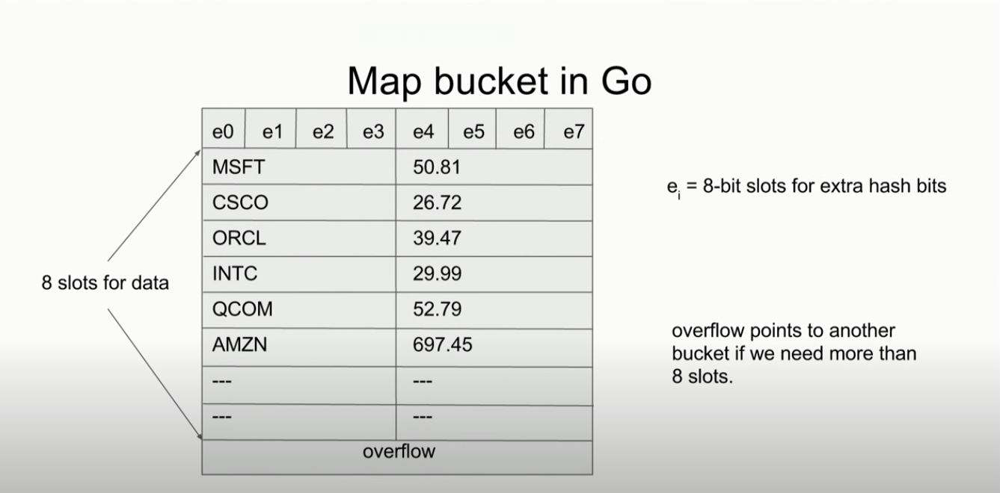
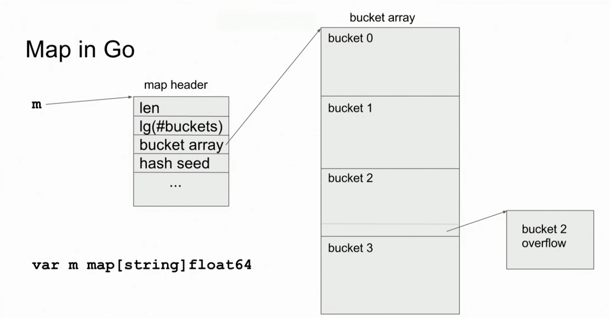
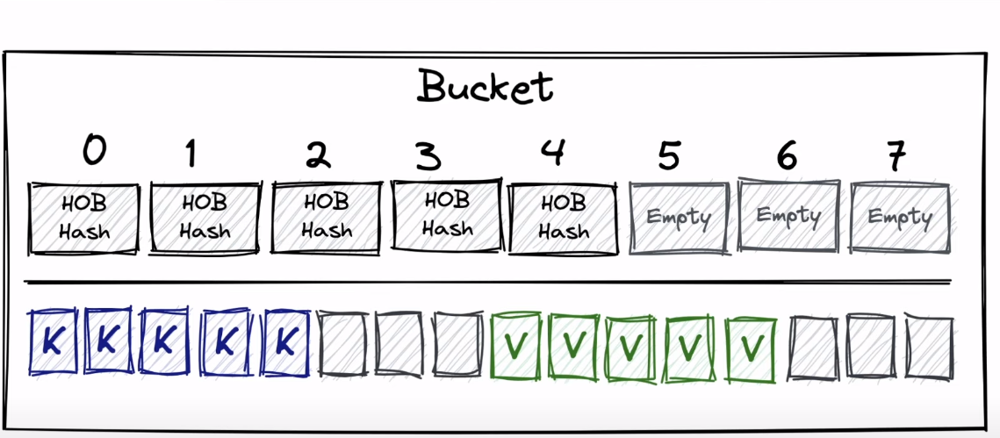

- константное время исполнения
- ключ должен быть comparable (key1==key2)
- если ключа нет, то вернется нулевое значение, нужно использовать val,ok:=map
- элементы мапы не являются переменными, на них нельзя получить поинтер
- неинициализированная мапа==nil
- нельзя вносить значения в неинициализированную мапу
- доступ к элементу всегда дает значение
- мапы нельзя сравнивать между собой, можно сравнивать с nil
- для удаления из мапы метод

```go
    delete(mapName, "key")
```

- мапа состоит из хэш-функции, массива, адресации
- если хэш функция для двух разных ключей создала одинаковый хэш, то случается коллизия
- коллизия разрешается через цепочечную адресацию, когда по индексу хранится head связного списка и далее поиск идет по нему
- бакет мапы это участок памяти. Бакет состоит из двух структур данных: массив из 8 HOB из хэш ключа, по которому был выбран бакет и массив ключей и значений в формате [k k k e e e v v v e e e]. Если случится ситуация, когда занято больше 8 слотов, то оверфлоу будет указывать на другой бакет
- бакеты хранятся в массиве
- для проверки наличия значения мы хэшируем ключ, по хэшу ищем бакет в котором должно храниться значение по ключу, итерируем по 8 слотам бакета и возвращаем ответ
- если бакеты заполнены, то мапа увеличивается в размере
- бакет заполнен при средней заполненности в 6.5 значений
- эвакуация данных - аллоцируется новый массив вдвое большего размера. Значения из старых бакетов копируются в новые. Используются новые бакеты
- процесс увеличения мапы (эвакуации) происходит постепенно, при каждой процедуре вставки или удаления из мапы
- нельзя получить поинтер на значение из мапы, потому что она растет со временем
- мета-информация о типе ключа хранится в type descriptor, он представляет операции hash, equal, copy
- операции осуществляются через unsafe.Pointer
- хэш функция:
  - детерминизм - повторное хэширование одного и того же ключа должно быть всегда одинаково
  - равномерность - данные должны распределяться равномерно
  - эффективность - работает быстро
  - ограниченность - индексы-результаты должны быть ограничены размером таблицы
    <br/>
    
    
    
