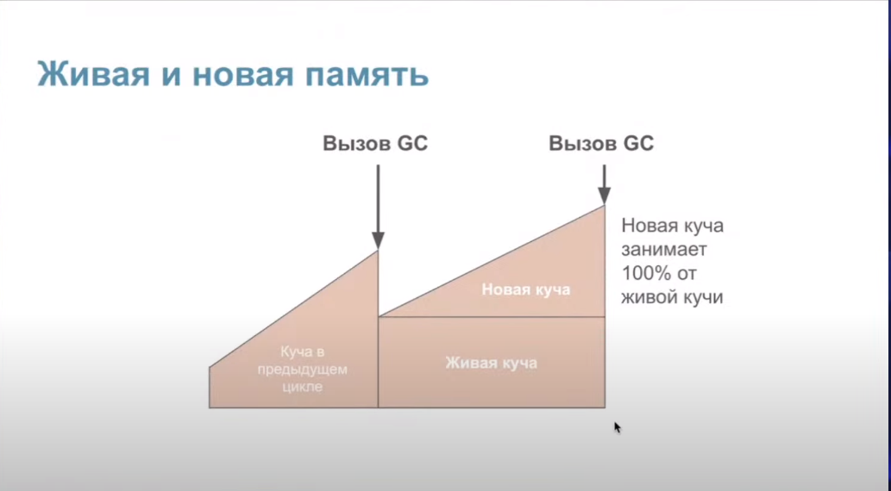
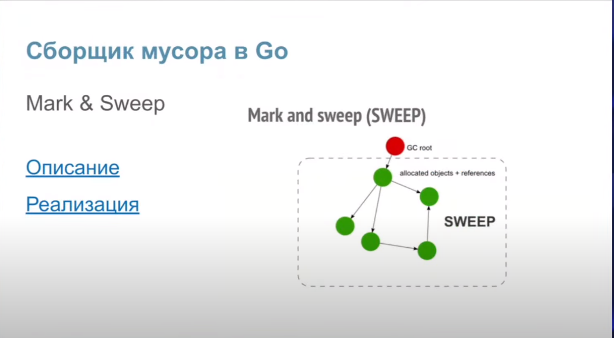
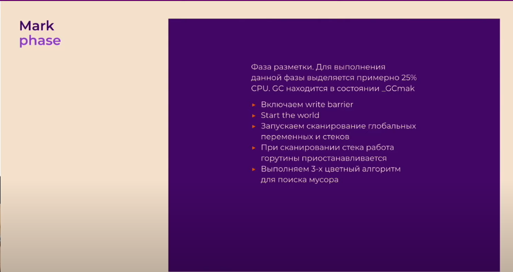
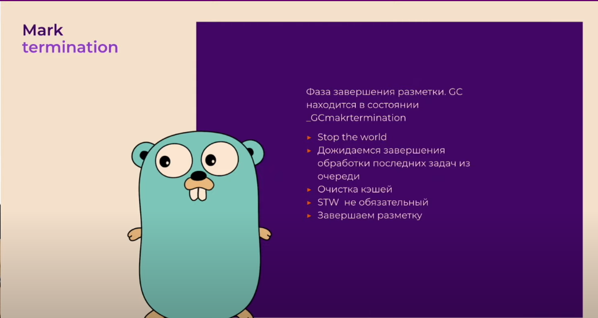
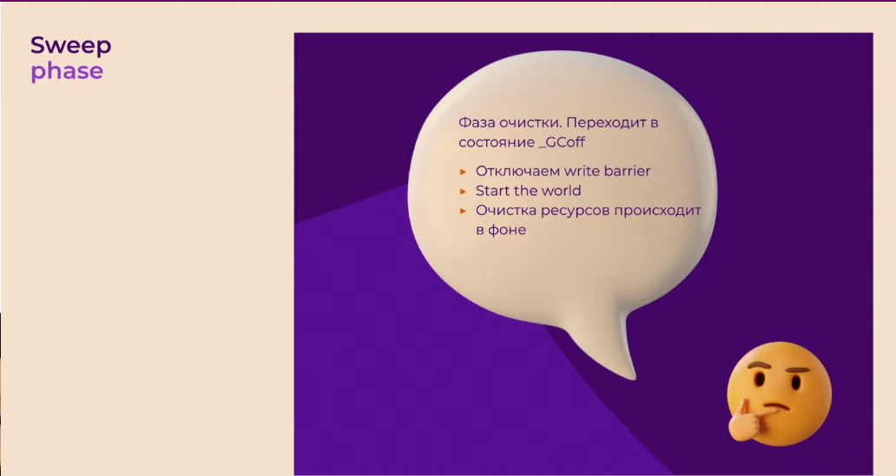

- escape analysis - компилятор определяет "сбежит" ли переменная из стека в хип
- для проверки go run -gcflags=-m main.go
- зачастую переменная помещается в стеке (точнее в фрейме стека, который был выделен специально для этой функции)
- когда переменная помещается в хипе:

  - если компилятор не может быть уверен, что переменная не используется после возврата из функции (например функция возвращает поинтер на результат калькуляции)
  - если размер слишком большой для стека: массивы больше 10МБ и слайсы больше 64КБ сбегут в хип
  - если компилятор не знает размер значения во время компиляции
  

- сборщик мусора работает по принципу mark and sweep: сначала проходит от корневого объекта по дереву объектов и помечает живые объекты, все не помеченные удаляются
- алгоритм трехцветный - черный это корневой объект, серый это потомок черного (и тоже станет черным), белый - мусор (на который никто не указывает)
- stop the world - полная остановка программы, необходима для включения и отключения барьера записи
- переменная GOGC - процент новой необработанной памяти хипа от живой памяти, при достижении которого будет запущена сборка мусора; GOGC = 100 означает, что сборка мусора будет запущена, когда объем новой памяти достигнет 100% от объема живой пямяти хипа (альтернативно можно сделать через debug.SetGCPercent)
- за размером памяти следит pacer
- память в сборщике мусора содержит в себе живую память кучи (память, которая была помечена как живая в предыдущем цикле сборки мусора), новую память кучи (память кучи, которая еще не была проанализирована сборщиком мусора), а также память, используемую для хранения некоторых метаданных, которая обычно незначительна по сравнению с первыми двумя сущностями
- ручной запуск с помощью runtime.GC(). Если сделать этот вызов, когда Garbage Collector уже запущен, то по достижении фазы Sweep он запустится заново
- отключить сборку мусора можно черезе GOGC = off или debug.SetGCPercent(-1)
- чтобы избежать ошибки 137 out of memory используется переменная GOMEMLIMIT или debug.SetMemoryLimit. Задает общее количество памяти, которое рантайм может использовать
- трехцветный алгоритм разметки выполняется параллельно с основой программой, которая называется мутатором. Для поддержания консистентности данных в хипе используется write barrier
- его основная задача - следить, чтобы черные объекты не указывали на белые
- в Golang память отмечается доступной для перезаписи, запускается горутина, которая постепенно возвращает её системе. За этот процесс отвечает Scavenger. Все достижимые объекты продолжают жить нетронутыми
- Стадии работы GC
  - Текущая стадия работы сборщика мусора хранится в глобальной переменной gcphase.
    - Sweep Termination. Останавливаем мир 🙂 Это нужно, чтобы все процессоры дошли до точки, когда можно безопасно запустить GC. После этого все блоки памяти, отмеченные как мусор, отправляются «на съедение» Scavenger. Потом он вернёт их ОС. Это позволяет не запрашивать у ОС больше памяти, чем требуется приложению. В обычных обстоятельствах к началу работы GC вся «мусорная» память уже возвращена системе. Необычным обстоятельством может считаться ручной запуск GC.
    - Mark. Глобальная переменная gcphase выставляется в значение \_GCmark. Включается Write Barrier. Создаются и ставятся в очередь джобы с покраской корневых вершин. Корневые вершины — это глобальные переменные и всё содержимое стека.
    - Запускаем мир. Теперь маркировка объектов происходит в специальных воркерах-малярах, запущенных шедулером. Эти воркеры в проходятся по всем объектам в куче и на стеке. Новые аллоцированные объекты сразу красятся в чёрный. Чтобы просканировать стек горутины, её останавливают, прокрашивают стек и снова запускают. Так продолжается до тех пор, пока не закончатся серые объекты. В этой фазе GC забирает до 25% от CPU, это число зашито внутри runtime go.
    - Mark Termination. Останавливаем мир, выставляем gcphase на \_GCmarktermination, выключаем воркеров, которые красили объекты в памяти. runtime готовит будущую работу программы. Например, чистит кеш у M.
    - Sweep. Выставляем gcphase на \_GCoff, выключается Write Barrier. Запускаем мир. Теперь новые аллоцированные объекты будут покрашены в белый. Аллокация может происходить поверх блоков памяти, отмеченных как мусор. Кроме того, будет запущена горутина, которая будет постепенно возвращать мусорную память ОС.
- причины запуска GC:

  - превышение динамического лимита «сожранной» приложением памяти, установленного с помощью переменной GOGC.
  - прошло 2 минуты без GC. За это ответственен Sysmon — особый тред приложения. Он отвечает за запуск GC по таймеру, preemption горутин и другие важные функции. Этот способ можно отключить, выставив значение GOGC < 0.
  - ручной запуск с помощью runtime.GC(). Если сделать этот вызов, когда Garbage Collector уже запущен, то по достижении фазы Sweep он запустится заново.

- для оптимизации использования памяти можно использовать sync.Pool или арену
- sync.Pool это хранилище объектов (одного типа), из которого их можно брать "на прокат" и потом возвращать, тем самым каждый раз используя одну и ту же память, не аллоцируя ничего нового. Потокобезопасен
- арена это аллоцированный большой кусок памяти, который сам управляет памятью без помощи GC. Освобождается целиком. Уменьшает количество вызово GC. Не потокобезопасен
   
  
  
  
  
  
